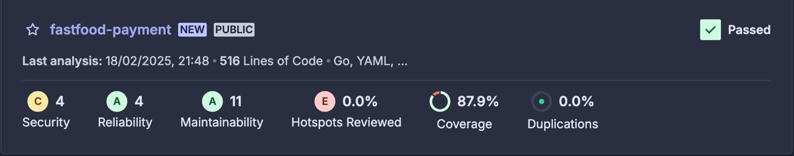

# Fastfood Payments API - GRUPO 35

## Conteúdo

- [Sobre](#sobre)
- [Cobertura de testes](#cobertura-de-testes)
- [Contribuidores](#contribuidores)

## Sobre

Microserviço de Payments responsável por gerenciar os pagamentos, utilizando serviços da AWS como RDS, EC2.

## Cobertura de testes




## Como rodar a aplicação

Para rodar a aplicação, deve-se executar o comando:

```
docker-compose up
```

Para visualizar o **Swagger**, devemos manter a aplicação rodando e acessar a URL abaixo:

`http://localhost:8000/swagger/index.html`

<!-- 
# Rodar os testes

1. Instalação do gomock para execução dos testes localmente

```
go install go.uber.org/mock/mockgen@latest
```

2. Geração dos arquivos de mock preenchidos via go generate no projeto

```
go generate ./...
```

3. Execução dos testes do projeto

```
go test ./test/...
``` -->


## Video de Demonstração

- Video demonstrando as funcionalidades solicitadas na Fase 2: https://youtu.be/t0N95YRmOIw
- Video demonstrando as funcionalidades solicitadas na Fase 3: https://youtu.be/y60eYS9Pr0k


## Contribuidores

- Egio Lima
- Gabriel Rosa Nunes
- Irlan Gomes
- Jhony Eduardo Senem